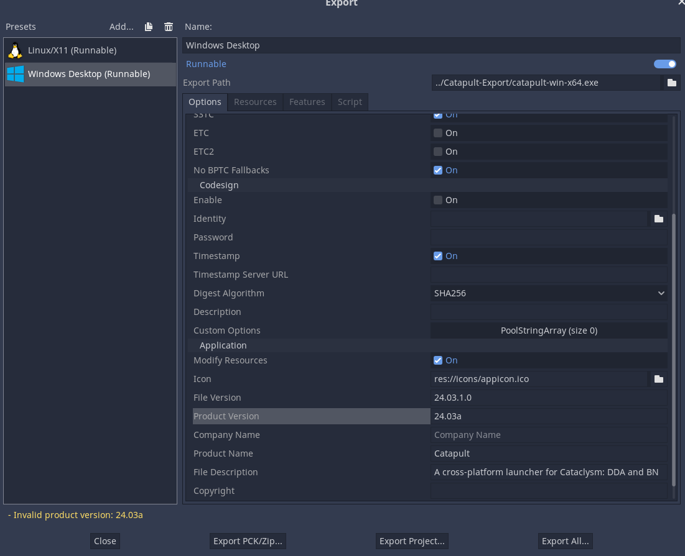
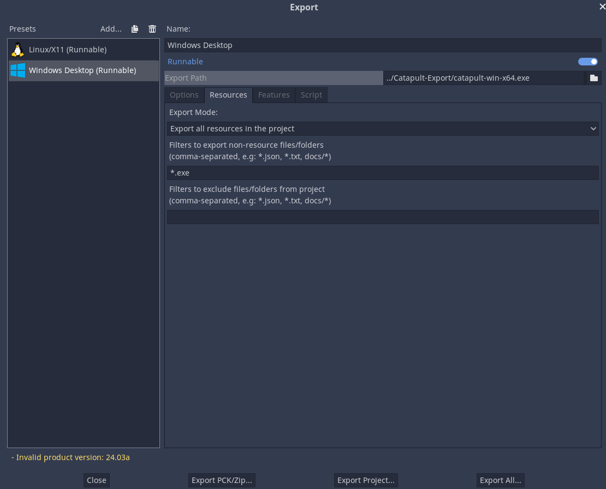

# Contributing
## Working with the project

The project uses Godot 3.

### Godot export settings

#### Linux

- Enable `Binary Format` > `Embed PCK`

#### Windows

- Enable `Binary Format` > `Embed PCK`
- Configure Application section with apporpriate info according to the image bellow. (configure rcedit path if needed)
- In `Resources` tab, set `Filters to export ...` to `*.exe` (this will make Godot bundle the programs from `utils` dir)

## Why I am making yet another launcher (by qrrk)

I had had ideas about making my own launcher for a couple years, but it didn't go beyond small demos until August 2021. The main reasons for me to start active work on it were that:

- there was no launcher for Linux with a GUI;
- there was no launcher for C:BN with advanced features, such as mod and soundpack management.

I thought, wouldn't it be nice if a unified launcher existed that was cross-platform and supported both forks of the game. I decided: well, if the thing I want isn't there on the internets, I guess I'll just *make* it!

My selection of tools wasn't great, since I wanted the app to be cross-platform and ship as one self-contained executable, like remyroy's launcher used to. I initially started making it with Python/Gtk/PyInstaller, but the latter didn't want to cooperate, especially on Windows. I started looking into other options, but nothing quite fit the requirements.

I was almost desperate enough to use Electron, but then I remembered about my old buddy [Godot](https://godotengine.org/), with which I had some limited experience. I knew that it had a good UI system, and some non-game desktop apps had already been made with it. After some prototyping it seemed like it was going to work. Of course, Godot apps aren't as lightweight as fully native binaries, but they are nowhere near Electron in terms of size and resource usage. I think you'll agree that it would have been awkward if a game launcher was heavier than the game itself!

Once I confirmed that Godot was a good fit, I moved the project to it and started fleshing it out. I worked in secret, since I have a nasty habit of burning out and losing interest half-way though projects, so I didn't want to announce anything until some kind of MVP was achieved. Therefore, the first public release of the launcher is already in a fairly finished state.

I am an amateur, and developing something for the public and with a clear practical purpose is new to me, so feedback and criticism are welcome (constructive or not, I can take it).
