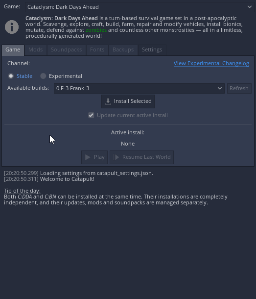

# Catapult

**Catapult** is a cross-platform launcher and content manager for [Cataclysm: Dark Days Ahead](https://github.com/CleverRaven/Cataclysm-DDA) and [Cataclysm: Bright Nights](https://github.com/cataclysmbnteam/Cataclysm-BN). It is in part inspired by earlier versions of [Rémy Roy's launcher](https://github.com/remyroy/CDDA-Game-Launcher).

<table>
  <tr><th colspan="2">Releases</th></tr>
  <tr>
    <td>Latest</td>
    <td></td>
  </tr>
  <tr>
    <td>All</td>
    <td></td>
  </tr>
</table>

<table>
  <tr><th>Development builds</th></tr>
  <tr>
    <td>
      
       
      ℹ️ Need GitHub account to download 
      ⚠️ May be unstable; not recommended for everyday use
    </td>
  </tr>
</table>
 

## Features

- Automatic game download and installation (stable or experimental releases).
- Ability to install multiple versions of the game and switch between them.
- Updating the game while preserving user data (saved games, settings, mods, etc).
- Mod management: [Kenan Modpack](https://github.com/Kenan2000/CDDA-Kenan-Modpack) download and complete or selective installation.
- Automatic download and installation of soundpacks.
- Customization of game fonts.
- Saved game backups.
- Multilingual interface.
- Fully portable and can be carried on a removable drive.
- Good support for HiDPI displays: UI is automatically scaled with screen DPI, with ability to adjust the scale manually.

## Installation

None required. The launcher is a single, self-contained executable. Just [download](https://github.com/qrrk/Catapult/releases/latest) it to a separate folder and run.

### Linux
- You need write permission in the folder that contains the Catapult executable.
- The catapult executable [should have execution permission enabled](https://askubuntu.com/a/485001).
- The game needs the following dependencies, Some distros come with these preinstalled, but others don't.: `sdl2`, `sdl2_image`, `sdl2_ttf`, `sdl2_mixer`, `freetype2`, `zip`
    - On Debian based distros (Ubuntu, Mint, etc.): `sudo apt install libsdl2-image-dev libsdl2-ttf-dev libsdl2-mixer-dev libfreetype6-dev zip`
    - On Arch based distros `sudo pacman -S sdl2 sdl2_image sdl2_ttf sdl2_mixer zip`
    - On Fedora based distros `sudo dnf install SDL2 SDL2_image SDL2_ttf SDL2_mixer freetype zip`

#### Packaging

- For Arch Linux, an [official AUR package](https://aur.archlinux.org/packages/catapult-bin) is available.

## System requirements

- 64-bit operating system.
- Windows 7+ or Linux.
- OpenGL 2.1 support.

## Contributing

Checkout [CONTRIBUTING.md](./CONTRIBUTING.md).
