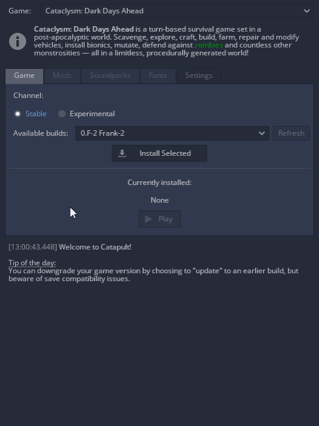

# Catapult

**Catapult** is a cross-platform launcher and content manager for [Cataclysm: Dark Days Ahead](https://github.com/CleverRaven/Cataclysm-DDA) and [Cataclysm: Bright Nights](https://github.com/cataclysmbnteam/Cataclysm-BN). It is in part inspired by earlier versions of [Rémy Roy's launcher](https://github.com/remyroy/CDDA-Game-Launcher).

[**Download latest release**](https://github.com/qrrk/Catapult/releases/latest)  |  [**See all releases**](https://github.com/qrrk/Catapult/releases)

## Features

- Automatic game download and installation (stable or experimental releases).
- Ability to install multiple versions of the game and switch between them.
- Updating the game while preserving user data (saved games, settings, mods, etc).
- Mod management: [Kenan Modpack](https://github.com/Kenan2000/CDDA-Kenan-Modpack) download and complete or selective installation.
- Automatic download and installation of soundpacks.
- Customization of game fonts.
- Saved game backups.
- Multilingual interface.
- Fully portable and can be carried on a removable drive.
- Good support for HiDPI displays: UI is automatically scaled with screen DPI, with ability to adjust the scale manually.

## Installation

None required. The launcher is a single, self-contained executable. Just [download](https://github.com/qrrk/Catapult/releases/latest) it to a separate folder and run.

- Be sure you have write permission in that folder.
- On Linux, [make the file executable](https://askubuntu.com/a/485001) before running it.
    - If the game does not start on Linux, make sure you have the following dependencies installed: `sdl2`, `sdl2_image`, `sdl2_ttf`, `sdl2_mixer`, `freetype2`. Some distros come with these preinstalled, but others don't.
    - For Arch Linux, an [unofficial AUR package](https://aur.archlinux.org/packages/catapult-bin) is available.

## System requirements

- 64-bit operating system.
- Windows 7+ or Linux/X11.
- OpenGL 2.1 support.

## Contributing

Checkout [CONTRIBUTING.md](./CONTRIBUTING.md).